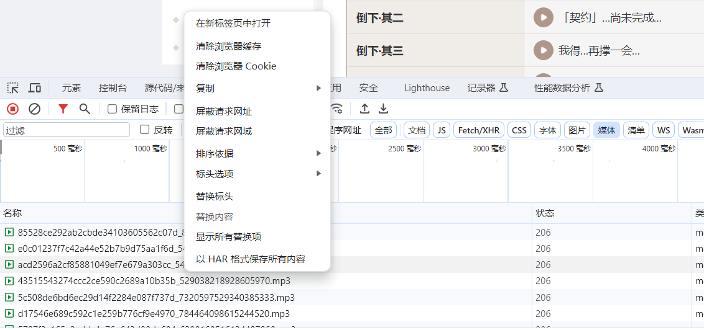

[TOC]

# MyTools

自己写的一些格式转化的工具

注：以下所有Main()函数均可指定source与target

1. 如果从控制台输入，则程序会扫描输入路径下的所有目标格式的文件，并将其按照规则转化为另一格式的文件
2. 如果控制台没有输入，则会使用默认路径：`../doc/source.lrc`、`../doc/source.ass`
2. 修改`main.cpp`中的`fileType`，以指定需要查找的文件格式类型

## LRC转ASS

```c++
LRC_TO_ASS::Main(source, target)
```

**lrc格式要求**

1. 时间戳： `[min:second.ms]`，如`[00:14.01]`
2. 最后一行：空语句, 表示整首歌的结束时间
2. 字符必须是UTF-8编码，否则读入会有问题

使用方法：

1. 将**.lrc**文件放到默认目录`../doc/`下，或者指定目录下
2. **ctrl+F5**运行即可，如果是指定目录，则需要在控制台输入目录

## SRT转ASS

```c++
SRT_TO_ASS::Main(source, target)
```

使用方法：

1. 将**.srt**文件放到默认目录`../doc/`下，或者指定目录下
2. **ctrl+F5**运行即可，如果是指定目录，则需要在控制台输入目录
3. 修改`SRT.cpp/ChineseFirst`，以设定SRT文件是否优先中文

## EPUB转TXT

```c++
HTML_TO_TXT::Main(sourcePath, target);
```

使用方法：

1.   将**.epub**文件用Bandizip打开，将其中的OPS文件夹解压出来
2.   **OPS**文件夹内应该是**chapter*.html**
3.   将所有的**chapter*.html**放到默认目录`../doc/`下，或者指定目录下
4.   **ctrl+F5**运行即可，则需要在控制台输入目录

## TXT中的xxx转为第xxx章

将原本**.txt**文件中的xxx改为第xxx章

```c++
TXT_TO_TXT::Main(source, target)
```

格式要求：

1.   **只能在标题中出现空格**

使用方法：

1. 将**.txt**文件放到默认目录`../doc/`下，或者指定目录下
2. **ctrl+F5**运行即可，如果是指定目录，则需要在控制台输入目录

## TXT中删除不规则换行

```c++
TXT_TO_TXT_Delete_Space::Main(source, target);
```

使用方法：

1. 将**.txt**文件放到默认目录`../doc/`下，或者指定目录下
2. **ctrl+F5**运行即可，如果是指定目录，则需要在控制台输入目录

# Python大法好

> C++解决不了的，交给Python吧
>
> 有时候，选择比努力更加重要

## download_media_from_har

1. 在**谷歌浏览器**中，按F12，进入网络界面

2. 依次点击角色的每一条语音，可以在网络界面看到，接收到了很多mp3文件

3. 右击，**以HAR格式保存所有内容**，会下载一个har文件

   

4. 将har文件移动至当前目录，python脚本会自动识别其中类型为`media`的文件，并将其下载到`download`文件夹中
